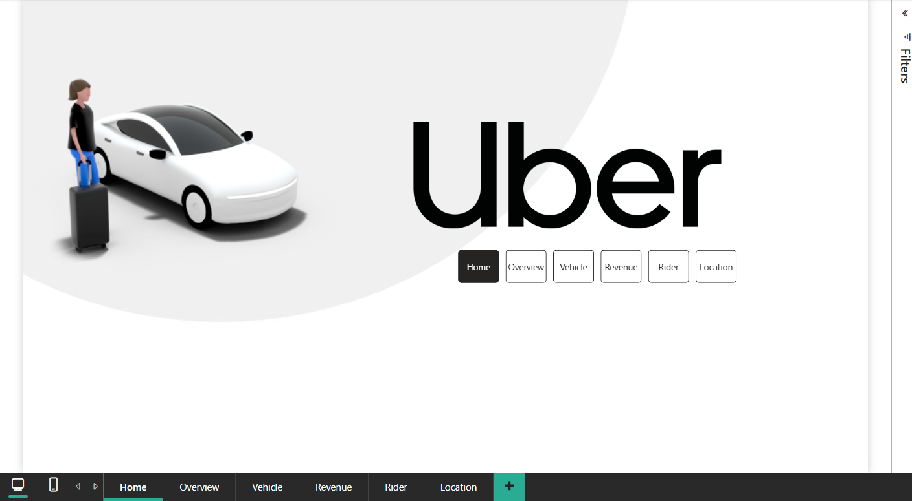
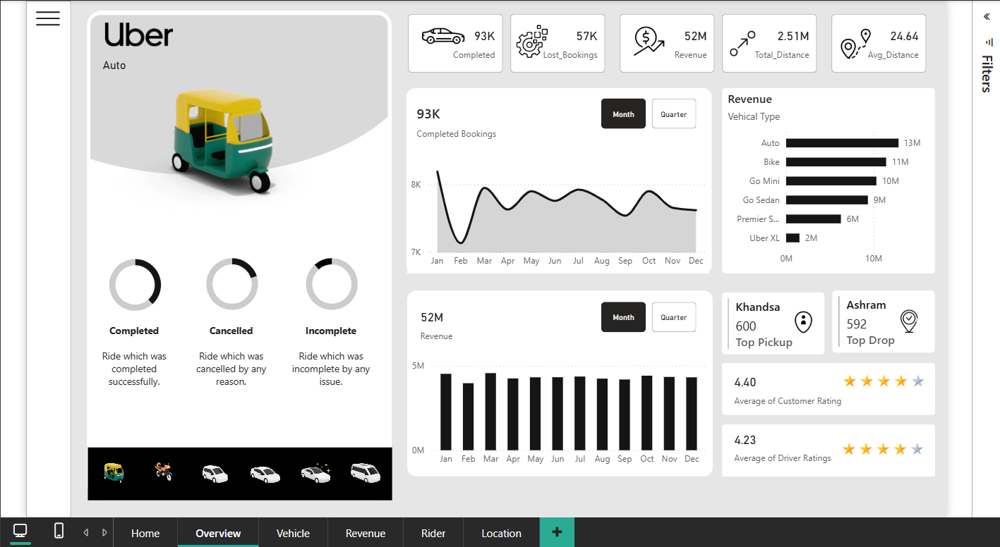
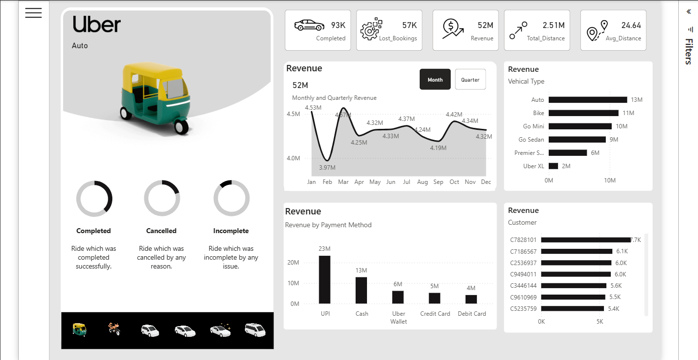
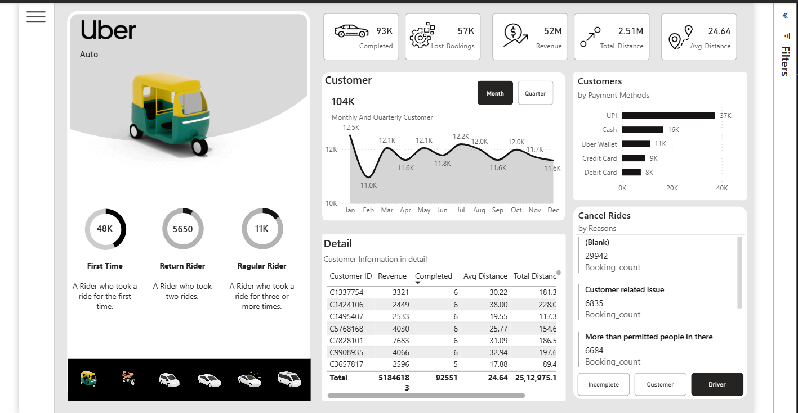
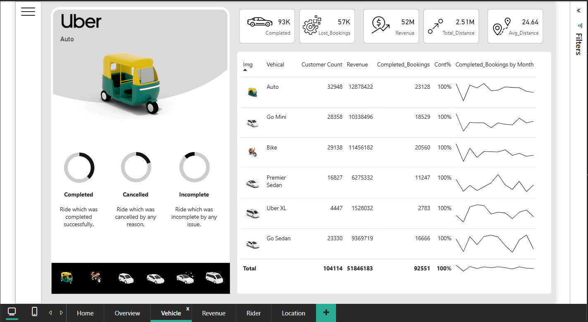
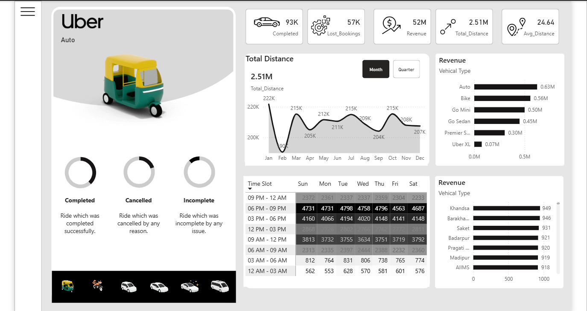

# Uber Ride Analytics Dashboard — Power BI

An interactive Uber Ride Analytics dashboard developed using Microsoft Power BI to analyze ride bookings, revenue, customer/rider information, vehicle performance, and location-based insights.

## 📊 Project Overview

This project focuses on transforming Uber ride data into an interactive business intelligence dashboard using Power BI.

The dashboard provides multiple analytical views to explore ride activity, revenue, customer/rider information, vehicle performance, and location-related trends.

## 🛠️ Tools & Technologies

- Microsoft Power BI
- Power Query
- DAX
- Data Modeling
- Data Visualization
- Microsoft Excel

## 📑 Dashboard Pages

### 🏠 Home

The Home page provides the main dashboard navigation and access to the different analytical sections.

### 📊 Overview

The Overview page presents a high-level view of Uber ride and booking performance through interactive KPIs and visualizations.

### 💰 Revenue

The Revenue page focuses on revenue-related analysis and helps explore booking value and revenue trends.

### 👤 Rider

The Rider page provides analysis related to customers and riders using interactive visualizations.

### 🚗 Vehicle

The Vehicle page provides analysis of Uber vehicle types and their performance.

### 📍 Location

The Location page provides location-based analysis of the Uber ride data.

## 🔍 Key Features

- Interactive Power BI dashboard
- KPI cards for important business metrics
- Interactive slicers and filters
- Vehicle-type analysis
- Booking analysis
- Revenue analysis
- Customer/Rider analysis
- Location-based analysis
- Date and time-based analysis
- Interactive page navigation
- Data transformation using Power Query
- DAX measures for analytical calculations

## 📸 Dashboard Preview

### Home

### Overview

### Revenue

### Rider

### Vehicle

### Location

## 📁 Project Files

- `PowerBI/Uber.pbix` — Power BI dashboard file
- `Dataset/uber.xlsx` — Dataset used for the analysis
- `Screenshots/` — Dashboard page screenshots

## 🎯 Learning Outcomes

Through this project, I practiced:

- Data cleaning and transformation using Power Query
- Creating DAX measures
- Building relationships between data tables
- Creating interactive Power BI visualizations
- Designing business intelligence dashboards
- Using slicers and interactive navigation
- Presenting data-driven insights in a user-friendly format

## 👩‍💻 Project Type

This is a hands-on Power BI analytics project created to practice data analysis, business intelligence, data visualization, Power Query, and DAX.
